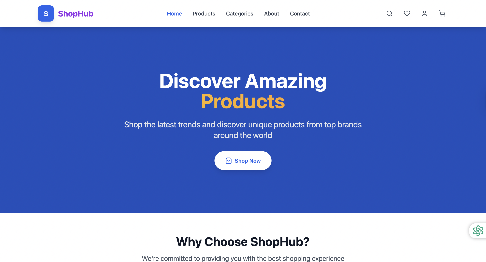
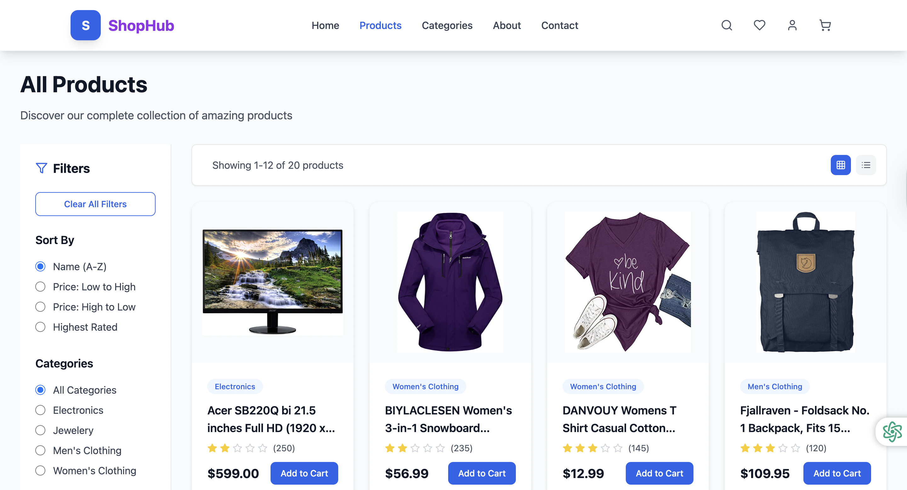
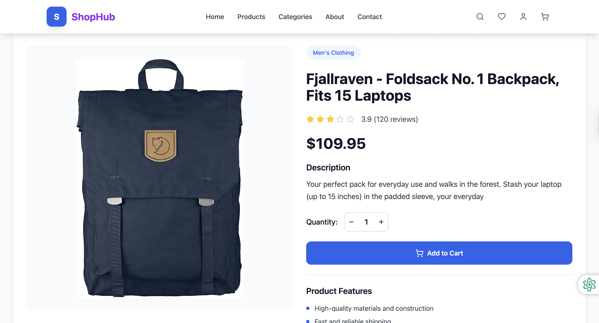

---

## 🚀 Getting Started

1. **Repository Clone karo:**
   ```bash
   git clone https://github.com/chaurasiapk/shop-hub.git
   cd YOUR-REPO
   ```

2. **Dependencies install karo:**
   ```bash
   npm install
   # ya
   yarn install
   ```

3. **Development server start karo:**
   ```bash
   npm run dev
   # ya
   yarn dev
   ```

### 4. Build for Production

```bash
npm run build
# or
yarn build
```

### 5. Preview Production Build

```bash
npm run preview
# or
yarn preview
```

---

## 🌐 Deployment

- **Vercel** ya **Netlify** par 1-click deploy ho sakta hai.
- **Build command:** `npm run build`
- **Publish directory:** `dist`

---

## 🖼️ Screenshots

   ## 🖼️ Screenshots

   ### Home Page
   

   ### Products Page
   

   ### Product Details
   

> **Note:** Apne screenshots ko `screenshots/` folder me daalein aur upar ke file names ke hisaab se rename karein.

---

## 📝 Implementation Details

- **React + TypeScript:** Pure component-based architecture for scalability and maintainability.
- **Tailwind CSS:** Utility-first CSS framework for rapid UI development and responsive design.
- **React Context API:** Cart and wishlist state management across the app.
- **React Router DOM:** Seamless client-side routing for SPA experience.
- **Folder Structure:**
  ```
  src/
    components/      # UI components (Header, ProductCard, etc.)
    context/         # Cart & global state management
    pages/           # Home, Product Details, Cart, etc.
    routes/          # App routing
    types/           # TypeScript types
    App.tsx          # Main app component
    main.tsx         # Entry point
    index.css        # Global styles
  ```
- **Reusable Components:** ProductCard, Header, CategoryNav, BackToTop, etc.
- **Responsive Design:** Mobile-first approach, works on all devices.
- **Modern UI/UX:** Clean, attractive, and user-friendly interface.
- **Future Ready:** Easily extendable for authentication, payment, reviews, etc.

---

## 🔮 Future Enhancements

- User authentication & profiles
- Persistent wishlist
- Product reviews & ratings
- Payment integration
- Order history & tracking

---

## 📄 License

MIT License

---

**Made with ❤️ by Pradeep Chaurasia**

> _Note: Ye app demo/mock data use karti hai. Production ke liye apne backend API se integrate karein._